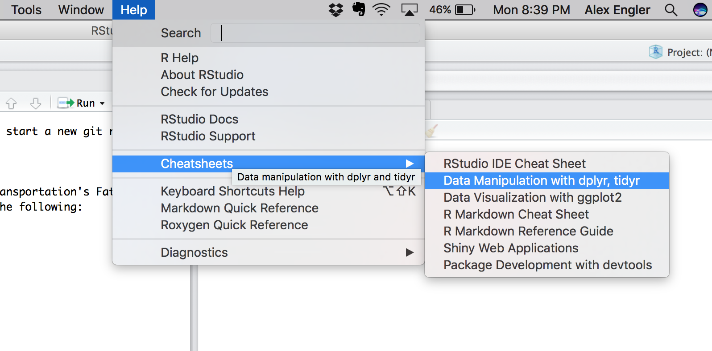

```{r setup, include=FALSE}
knitr::opts_chunk$set(echo = TRUE)
```

## Open RStudio

Since you installed R and RStudio during class, you should simply need to open RStudio (not R) in order to get started. RStudio is a tool to make working in R (the programming language) a bit easier and more intuitive. 

## Download the SAO Data

The State's Attoneys Office (SAO) has four datasets at the case level - which means each row of data describes one court case. You can find those datasets [under this search on the Cook County Data Catalog](https://datacatalog.cookcountyil.gov/browse?tags=state%27s%20attorney%20case-level). For your convenience, direct links to and descriptions of the datasets are provided here:

- [Sentencing](https://datacatalog.cookcountyil.gov/Courts/Sentencing/tg8v-tm6u): The sentencing data presented in this report reflects the judgment imposed by the court on people that have been found guilty. Each row represents a charge that has been sentenced.
- [Dispositions](https://datacatalog.cookcountyil.gov/Courts/Dispositions/apwk-dzx8): The disposition data presented in this data reflects the culmination of the fact-finding process that leads to the resolution of a case. Each row represents a charge that has been disposed of.
- [Initiation](https://datacatalog.cookcountyil.gov/Courts/Initiation/7mck-ehwz): The Initiation results data presented here reflects all of the arrests that came through the door of the State's Attorneys Office (SAO). An initiation is how an arrest turns into a “case” in the courts. Most cases are initiated through a process known as felony review, in which SAO attorneys make a decision whether or not to prosecute. Cases may also be indicted by a grand jury or, in narcotics cases, filed directly by law enforcement (labeled "BOND SET (Narcotics)" in this data). Included in this data set are the defendant counts by initiation and year. This data includes felony cases handled by the Criminal, Narcotics, and Special Prosecution Bureaus. It does not include information about cases processed through the Juvenile Justice and Civil Actions Bureaus.
- [Intake](https://datacatalog.cookcountyil.gov/Courts/Intake/3k7z-hchi): The intake data presented in this data reflects the cases brought in for review. Each row represents a potential defendant in a case.

## Loading Data Into R:

For our introduction, we will use the tidyverse, which is a set of R packages that enable quick and (somewhat) intuitive ways to explore and manipulate date in R. If you have already install the tidyverse using `install.packages("tidyverse")`, then you should just need to run the code below. 

```{r message=FALSE}
library(tidyverse)
```


\pagebreak 
 
## Pertinent Resources

**Introduction to haven package** [Link](https://blog.rstudio.org/2015/03/04/haven-0-1-0/)

**Introduction to readr package** [Link](https://github.com/tidyverse/readr)

**Introduction to readxl package** [Link](https://github.com/tidyverse/readxl)

**Vignette on dplyr package for Data Manipulation** [Link](https://cran.rstudio.com/web/packages/dplyr/vignettes/introduction.html)

**Data Processing with dplyr & tidyr** [Link](https://rpubs.com/bradleyboehmke/data_wrangling)

**String Manipulation with stringr** [Link](https://cran.r-project.org/web/packages/stringr/vignettes/stringr.html)

***

In the image above [Figure 1], you can see how to navigate to the RStudio Cheat Sheets for R's very useful data manipulation packages, `dplyr` and `tidyr`. These packages, as well as `stringr`, are also covered in detail in the free ebook [R for Data Science](http://r4ds.had.co.nz/transform.html).


